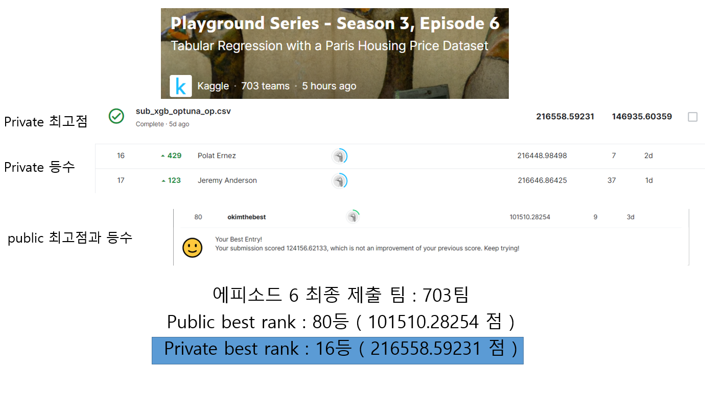
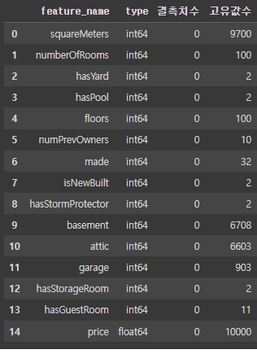
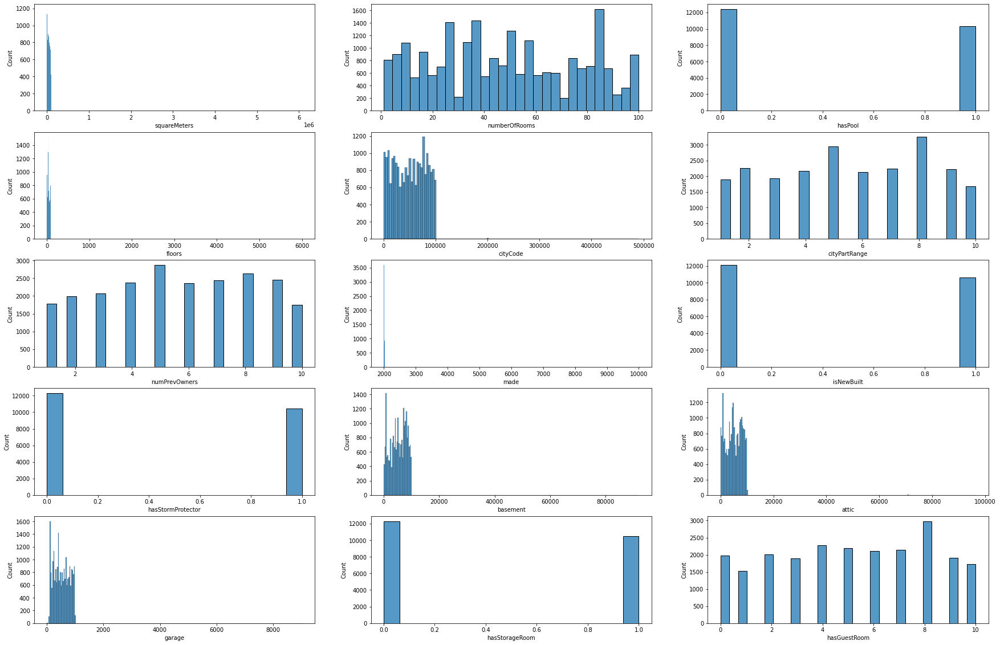
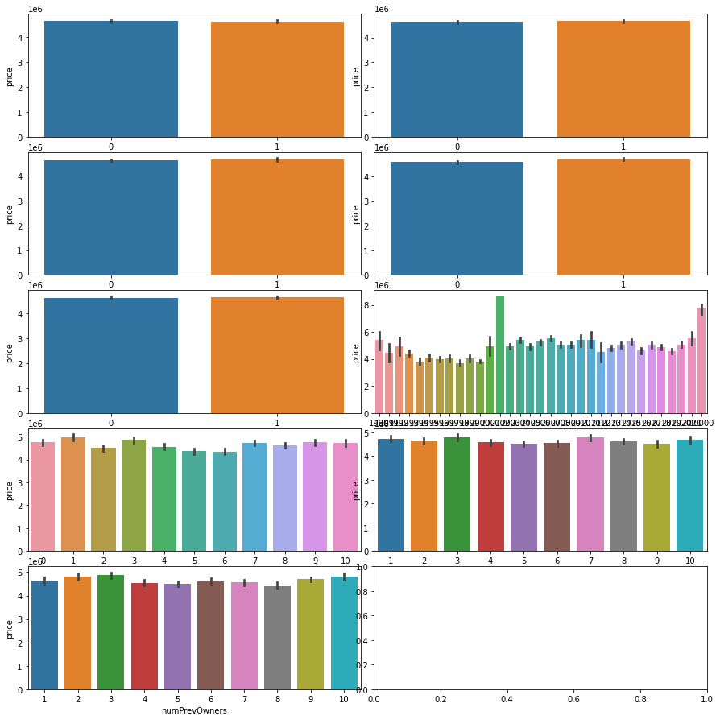
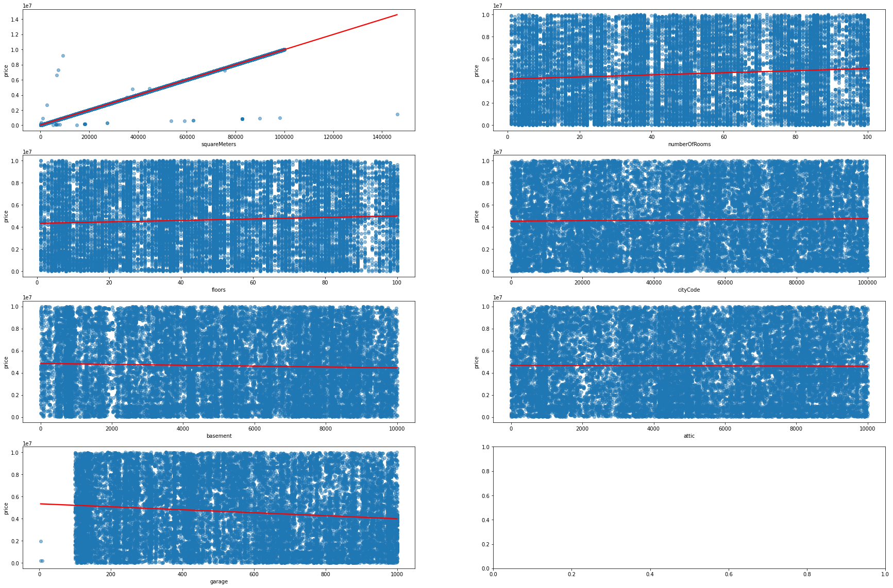
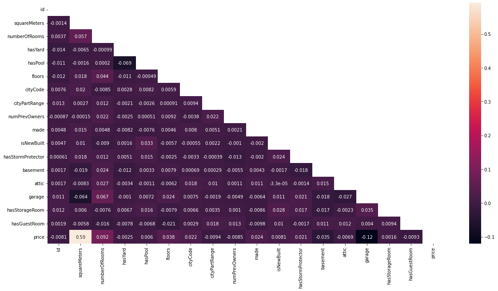
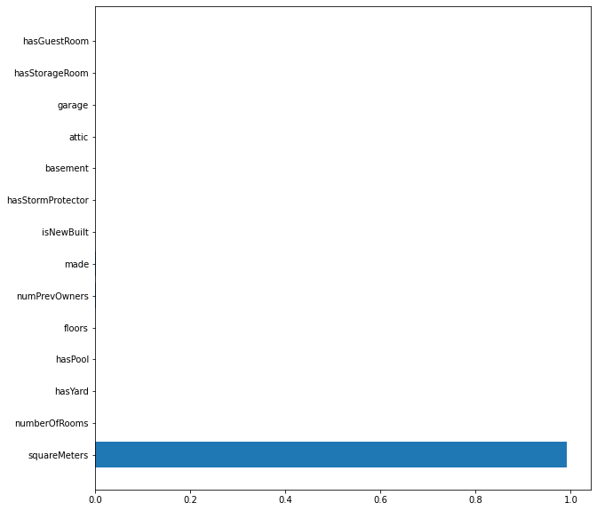

# Playground Series - Season 3 Episode 6
 

  :smirk: platforms & Languages

 
  
  	

 

<b> 최종 랭킹 18등 </b>

<b>1.   데이터 준비 및 분석</b>
  - 데이터 준비
  - 시각화 및 분석
  

 

<b>2.   베이스 모델</b>
  - xgb 베이스 모델 제작
  - feature_importance_ 확인

 

<b>3.   스케일링</b>
  - 베이스 모델과 비교해 가장 점수가 높은 방식 선택
  - MinMax
  - MaxAbs
  - Standard

 

<b>4.   피처 튜닝</b>
  - selector_best 5가지 선정하여 학습하여 결과 확인 후 피처 선정

 

<b>5.   모델 선정</b>
  - 대표 모델 gbm, xgb, lgbm 학습후 모델 선정

 

<b>6.   하이퍼 파라미터 튜닝</b>
  - Optuna를 사용하여 하이퍼 파라미터 튜닝

 

<b>7.   풀데이터 활용</b>
  - 선정된 피처, 모델, 파라미터를 사용해 풀데이터로 학습

 

- 검증 : RMSE
- 모델 버전 : xgboost 0.90

 

 

# 1. 데이터 준비 및 분석

 

##  <b>사용한 패키지</b>
- <b>기본 라이브러리</b>
- import pandas as pd 
- import numpy as np 

 

- <b>시각화</b>
- import matplotlib.pyplot as plt
- %matplotlib inline
- import seaborn as sns

 

- <b>데이터 정제</b>
- from sklearn.model_selection import train_test_split
- from sklearn.metrics import mean_squared_error

 

- <b>학습 모델</b>
- from xgboost import XGBRegressor
- from lightgbm import LGBMRegressor
- import xgboost as xgb

 

- <b>피처 튜닝</b>
- from sklearn.feature_selection import f_regression, SelectKBest

 

## 데이터 정보
- 결측치가 없음
- 모두 수치형
- 컬럼 개수가 많은것과 적은것으로 분류해 막대차트와 산포도로 표현 하면 좋아보임

## 컬렴벌 의미
- squareMeters : 평수
- numberOfRooms : 방 수
- hasYard : 마당 여부
- hasPool : 수영장 여부
- floors : 층
- cityCode : 도시코드
- cityPartRange : 도시 범위           
- numPrevOwners : 이전 소유자의 수
- made : 언제 만들어 졌는지
- isNewBuilt : 신축 여부
- hasStormProtector : 폭풍 보호 기능
- basement : 최하부
- attic : 다락방 여부
- garage : 차고 여부
- hasStorageRoom : 창고 여부
- hasGuestRoom : 게스트룸 여부
- price : 가격

 

## 컬럼 분포도
- 이상치를 가지고 있는 컬럼이 보임
- 예상 이상치 컬럼 : squareMeters, floors, cityCode, basement, attic, garage

 

## bar차트
- made를 제외하고는 변동폭이 없음

 

## regplot 차트
- 이상치 제거후 산포도
- squareMeters는 매우 관련있어보이고 나머지는 거의 관련 없음으로 예상

 

## heatmap 상관관계
- squareMeters만 상관관계가 있음으로 보임 ( 상관계수 0.59 )

## EDA 결과
- 고유값 40개 미만 컬럼에서는 made가 변별력있는 데이터로 보였으나 pointplot 결과 관련성이 보이지 않았다.
- 고유값이 많은 컬럼에서는 squareMeters이 가장 관련있는 데이터로 보여졌으며 다른컬럼에서는 산포도에서 정답에 필요한 데이터로 보이지 않았음
- 상관관계에서 squareMeters만이 관련성이 매우 높기에 관련 없어보이는 컬럼 삭제 결정

 

## 이상치제거
- 시각화한 자료를 바탕으로 이상치 기준 선정 후 제거
- train = train.query("made != 10_000") 
- train = train.query("squareMeters < 1e6")
- train = train.query("floors < 1000")
- train = train.query("garage < 1500")

- 미제거 train = train.query("basement < 20_000")
- 미제거 train = train.query("attic < 20_000")
   - 미제거시 점수가 올라서 관련있는 이상치로 판단

 

## 피처제거
- 관련성이 적은 피처중 베이스모델에서 점수가 낮은 피처 제거
- id : index 값이므로 제거
- cityCode, cityPartRange : citycode만으로는 설명할 수 없는 부분이 있어 파생피처를 만들지 않으면 삭제 결정

 

# 2. 베이스 모델
- XGBRegressor 

 

## 베이스 모델 학습
제출 : 101510 점

 

### feature_importance

 

# 3. 스케일링 ( 미완 ) 실제 값들의 크기 나열후 정리
- MinMax 거의 비슷하나 점수가 오히려 조금떨어짐
- MaxAbs 효과 없음
- Standard 효과 없음

 

# 4. 피처 튜닝
- SelectKBest

 

## 피처 튜닝
- 베이스모델 학습후 파라미터별 중요도의 대부분이 squareMeters 이였기에 중요도로 피처를 줄여서 학습
- SelectKBest 사용하여 5개의 중요 피처를 선별하여 학습
- 제출 KBest10 : 125245
- 제출 KBest5 : 120301
- 점수 상승이 없었기에 모든 컬럼사용 결정

 

# 5. 모델 선정

 

- GBM, XGB, LGBM 3가지 모델로 선별 결과 가장점수가 높은 XGB모델 사용 결정
- GBM 158829
- XGB 151210
- LGBM 169071

 

# 6. 하이퍼 파라미터 튜닝 ( 미완 ) 옵튜나 파라미터와 학습량 기제 
- Optuna XGB
- Optuna 학습회수 100회 기준

 

## 스코어 및 파라미터
- 점수 : 146496
- 최적 파라미터 {
'learning_rate': 0.45,
'n_estimators': 900,
'max_depth': 7}

 

# 7. 풀데이터 활용
- 점수 : 204380

# 8. 최종 점수
  
