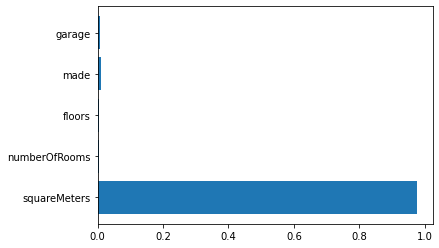

# project_2

1.   데이터 준비 및 분석
  - git clone 데이터 준비
  - 시각화 및 분석
2.   베이스 모델
  - xgb 베이스 모델 제작
  - feature_importance_ 확인
3.   피처 튜닝
  - selector_best 5가지 선정하여 학습하여 결과 확인 후 피처 선정
4.   모델 선정
  - 대표 모델 gbm, xgb, lgbm 학습후 모델 선정
5.   하이퍼 파라미터 튜닝
  - Optuna를 사용하여 하이퍼 파라미터 튜닝
6.   풀데이터 활용
  - 선정된 피처, 모델, 파라미터를 사용해 풀데이터로 학습

